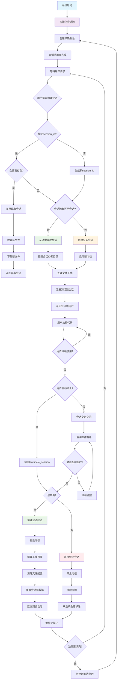
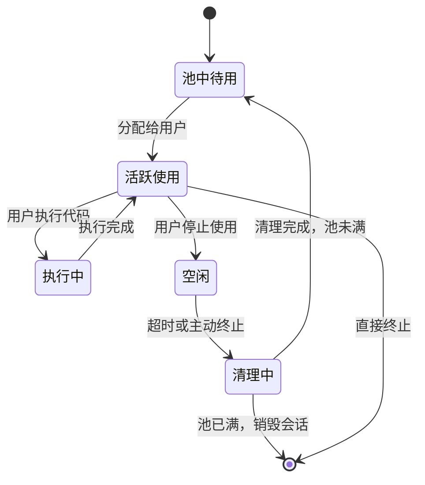
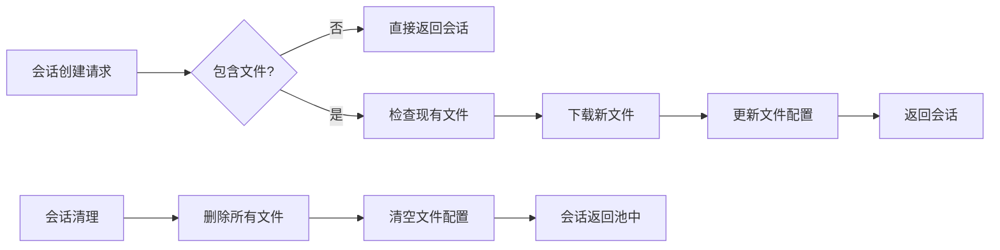

# Session管理生命周期流程图

## 会话池和会话管理的完整生命周期

## 关键组件说明

### 1. 会话池管理
- **初始化**: 系统启动时创建配置数量的预热会话
- **维护**: 后台循环检查池状态，自动填充到目标大小
- **复用**: 优先从池中获取已初始化的会话，提升创建速度

### 2. 会话生命周期状态

### 3. 文件管理流程

### 4. 性能优化点

1. **预热机制**: 池中会话已完成内核启动，避免用户等待
2. **智能复用**: 优先使用池中会话，显著减少创建时间
3. **延迟清理**: 会话终止时先尝试回收到池中，而非直接销毁
4. **自动维护**: 后台自动维护池大小，确保始终有可用会话

### 5. 配置参数

- `session_pool_size`: 池大小（默认3）
- `session_pool_max_idle_time`: 池中会话最大空闲时间（默认600秒）
- `session_pool_refill_interval`: 池填充检查间隔（默认30秒）
- `max_kernels`: 最大并发会话数
- `kernel_cleanup_interval`: 会话清理检查间隔

这个设计确保了高效的会话管理，通过会话池机制显著提升了用户体验，同时保持了系统资源的合理利用。